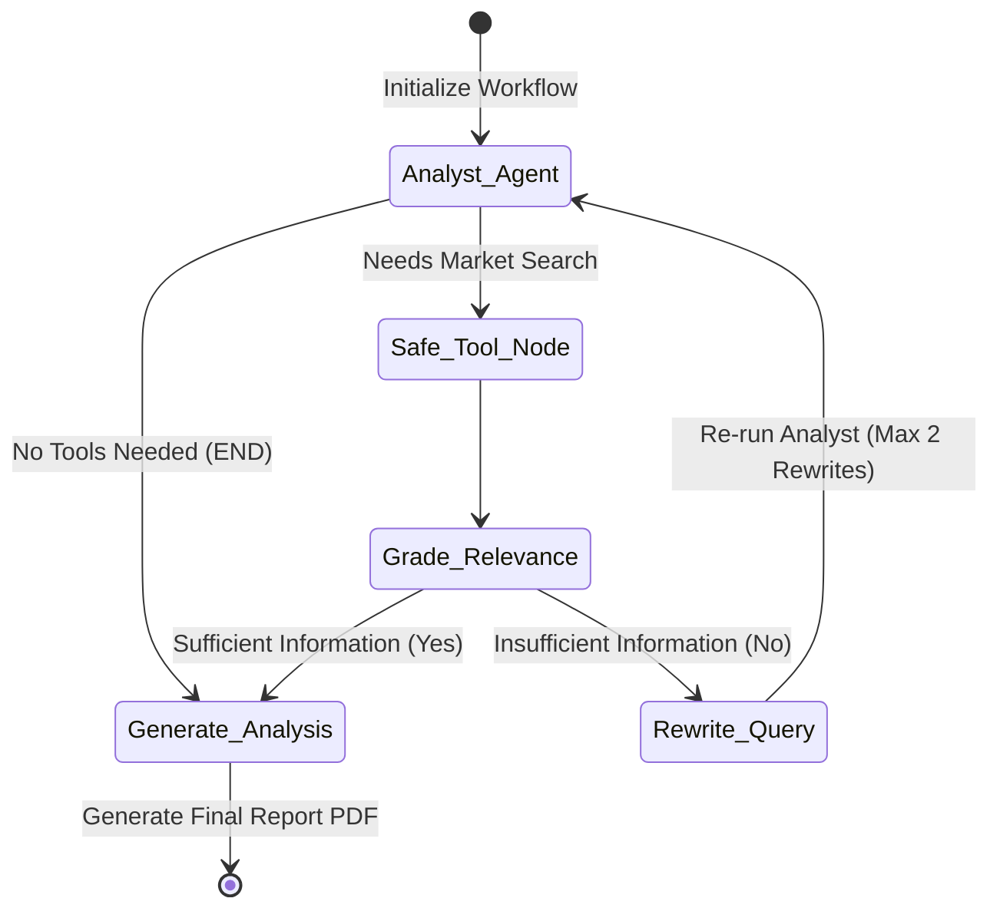
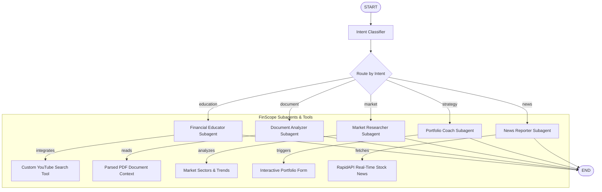

# DAO — AI Startup Evaluation & FinScope Advisory Platform

DAO is a high-performance, enterprise-grade AI evaluation platform built for startup analysis, market research, and investment education. By combining a multi-agent **LangGraph orchestration layer**, real-time search, Vector RAG search, compliance checking, and an automated PDF document publishing pipeline, DAO offers VC-grade analysis and real-time financial advisory.

The platform serves two primary interfaces:
1. **AI Startup Evaluation Pipeline**: An automated investor due-diligence engine that processes pitch decks and startup profiles, runs real-time web verification, and builds professional PDF reports.
2. **FinScope**: A specialized multi-subagent chat and educational system featuring automated intent routing, real-time finance news parsing, YouTube search integration, and interactive portfolio configuration.

---

## System Architecture

### 1. Startup Evaluation LangGraph Workflow
This workflow is used to generate investor-ready PDF reports. It iteratively searches the web and retrieves document embeddings until it has enough data to build a complete investment thesis.



### 2. FinScope Multi-Subagent Router
FinScope parses user intent dynamically and routes queries to specialized subagents for targeted financial guidance.



---

## Core Features

### 🏢 Startup Profiling & Management
* **Profile Registry**: Registers startup applications with key fields such as domain, description, team composition, funding requirements, and funding stage.
* **Compatibility Layer**: Supports both standard REST properties and legacy JSON inputs (`startupId`, `idea`, `teamSize`, etc.) to interface cleanly with various frontends.
* **Investor Q&A Chatbot**: A stateful chatbot interface (`/chat/{startup_id}` or `/chat/by-name/{name}`) allowing investors to perform interactive Q&A queries against the registered startup's background and documents.

### 📄 Intelligent Document Ingestion (Vector RAG)
* **Docling Integration**: Converts uploaded PDFs and DOCX files into rich Markdown formats, maintaining structure and tabular data.
* **Vector Embeddings**: Generates dense text embeddings using `sentence-transformers/all-MiniLM-L6-v2` run locally on CPU.
* **Qdrant DB Indexing**: Chunks and upserts data into Qdrant collections for high-relevance semantic search retrieval during agent analysis.
* **Resilient Hybrid Fallback**: Automatically degrades to full-text in-memory semantic processing if Qdrant services or local embedding models are offline.

### 🛡️ MCA Compliance & Registry Verification
* **CIN Verification**: Parses and validates Indian Company Identification Numbers (CIN) using standard regulatory formatting patterns.
* **MCA Data Integration**: Connects with Ministry of Corporate Affairs provider endpoints (with auto-mocking fallback) to verify registration details, company status, active status, and listed directors.
* **Consistency Grading**: Automatically analyzes differences between the startup's claims and verified registry data, flagging issues like `NAME_MISMATCH`, `NO_DIRECTORS_FOUND`, or `COMPANY_STATUS_SUSPENDED`.

### 📊 Automated PDF Generation with Embedded Matplotlib Charts
Produces publisher-quality PDF documents containing the complete AI evaluation report, legal status validation, and visual data:
* **Market Opportunity Chart**: Renders a custom matplotlib bar chart illustrating TAM, SAM, and SOM sizes.
* **AI Evaluation Scorecard**: Generates horizontal score bars across key dimensions (Product Strength, Market Size, Team Quality, Business Model, Moat, and Execution Risk).
* **Market Growth Trend**: Plots historical and projected growth trendlines.
* **Compliance Badge**: Dynamically styles green/red badges based on MCA verification results.

### 💬 FinScope Advisory Subagents
* **Financial Educator**: Demystifies complex financial jargon and weavs video tutorials directly into explanations via an integrated YouTube search utility.
* **Document Analyzer**: Evaluates document content and formats the response using strict UI tags:
  * `[FLASHCARD]` blocks representing company metadata, team, and investment verdicts.
  * `[COMPETITOR_CHART]` JSON blocks detailing competitor market shares, product accuracy, growth rates, and strengths.
* **News Reporter**: Direct integration with RapidAPI finance endpoints to retrieve stock-specific news, returning JSON-structured `[NEWS_CARD]` elements alongside market sentiment summaries.
* **Portfolio Coach**: Replaces wall-of-text advisories with interactive widget forms (`[PORTFOLIO_FORM]`) when user parameters are missing, rendering concise asset allocation tables once targets are submitted.

### ⚡ Real-Time Log Streaming
* Pipes internal execution logs, subagent thoughts, and system notices directly to clients via **Socket.IO** (`log_stream` channel), providing transparent visibility into the LangGraph pipelines.

### 🔒 Built-in Prompt Guardrails
* **Safety Filter**: Sanitizes incoming user requests against jailbreaks, bypass commands (`dan mode`), harmful prompt overrides, and off-topic requests before invoking agents.

---

## API Endpoints Reference

### 1. Startup & Portfolio APIs
| Endpoint | Method | Description |
| :--- | :--- | :--- |
| `/startups` | `POST` | Registers a new startup profile. |
| `/startups/{id}` | `PUT` | Updates an existing startup's properties. |
| `/startups/{id}` | `GET` | Retrieves profile and MCA status for a specific startup. |
| `/startups` | `GET` | Lists all registered startups. |
| `/api/startups/register` | `POST` | Alias for registering a startup (Express compatible). |

### 2. Document & Analysis APIs
| Endpoint | Method | Description |
| :--- | :--- | :--- |
| `/startups/{id}/documents` | `POST` | Processes and indexes document URL (PDF/DOCX) into Qdrant. |
| `/api/startups/{id}/documents/upload` | `POST` | Processes multipart/form-data document uploads. |
| `/api/startups/{id}/analyze` | `POST` | Triggers background LangGraph analysis worker. |
| `/api/startups/{id}/report/status`| `GET` | Polls the current state of background analysis. |
| `/reports/{id}` | `POST` | Executes the LangGraph pipeline and returns the generated PDF report. |

### 3. Verification & Chatbot APIs
| Endpoint | Method | Description |
| :--- | :--- | :--- |
| `/startups/{id}/verify/mca` | `POST` | Verifies a startup registry against MCA using a CIN. |
| `/startups/{id}/verify/mca` | `GET` | Retrieves stored MCA status and registry consistency flags. |
| `/chat/{id}` | `POST` | Interactive Q&A chat based on a specific startup's ID. |
| `/chat/by-name/{name}` | `POST` | Interactive Q&A chat based on a startup's name. |

### 4. FinScope APIs
| Endpoint | Method | Description |
| :--- | :--- | :--- |
| `/finscope/chat` | `POST` | Sends a message to the FinScope subagent coordinator. |
| `/finscope/analyze-document` | `POST` | Submits a document for structured FinScope analyzer flashcard parsing. |
| `/api/finance-news/headlines` | `GET` | Fetches raw live stock headlines for a symbol. |

---

## Environment Variables

Configure these settings inside your `.env` file:

```bash
# Core LLM API Key (Required)
GROQ_API_KEY=gsk_...

# Qdrant Database Settings (Optional, falls back to in-memory)
QDRANT_URL=https://...
QDRANT_API_KEY=...

# RapidAPI Finance Data Credentials (Optional, filters out live news if missing)
RAPIDAPI_KEY=...

# MCA Provider Config (Optional, defaults to Mock Sandbox logic)
MCA_API_KEY=...
MCA_API_URL=https://api.karza.in/v3/company-master

# Service Port (Defaults to 7860)
PORT=7860
```

---

## Development Setup

### Running with Docker (Recommended)
Build and run the containerized workspace:
```bash
docker build -t dao-service .
docker run -p 7860:7860 --env-file .env dao-service
```

### Running Locally
1. **Install System Dependencies** (Required for document conversion and chart rendering):
   * **macOS**: `brew install pkg-config gobject-introspection`
   * **Debian/Ubuntu**: `apt-get install build-essential python3-dev libglib2.0-0 libgl1`
2. **Install Python Packages**:
   ```bash
   pip install -r requirements.txt
   ```
3. **Start the Service**:
   ```bash
   python main.py
   ```
   The backend will be available at `http://localhost:7860` with interactive API docs at `http://localhost:7860/docs`.
